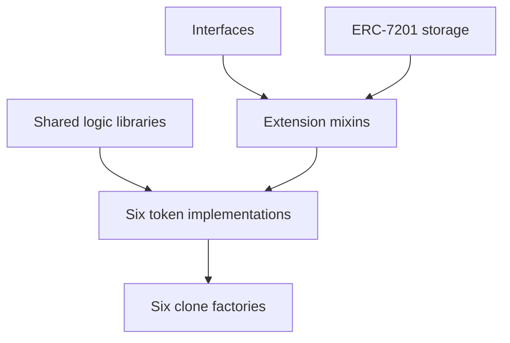

The reference implementation has six token contracts. Project shape and token standard are separate
choices.

| Project shape | ERC-721 unique tokens | ERC-1155 copies |
| --- | --- | --- |
| One work | `OneOfOneImage` | `OneOfOneEdition` |
| Many works | `SeriesImage` | `EditionImage` |
| Code or generative | `SeriesCode` | `EditionCode` |

## Extensions

Each optional feature is an abstract mixin with its own interface, events, storage namespace, and
version. Concrete tokens compose only the features they need.

Image contracts include onchain metadata and royalties. Series contracts add supply, minter, payee,
and pause controls. Code contracts add scripts, dependencies, seeds, and configurable parameters.

ERC-721 and ERC-1155 twins share extension IDs and behavior where the token standard allows it.
Edition supply is per token ID. Sequential ERC-721 supply is per collection.

## Storage

Stateful extensions use ERC-7201 namespaces. Storage slots come from unique names rather than
inheritance order, so mixins cannot overlap when reordered.

Small helper libraries compile into the token. Larger write paths use shared delegatecall libraries:

| Library | Job |
| --- | --- |
| `AbxMetadataLib` | Metadata fields and locks for all six token types |
| `AbxParamsLib` | Parameter schemas, values, and hooks |
| `AbxCodeLib` | Script and dependency writes |
| `AbxEditionLib` | ERC-1155 metadata and supply paths |

These libraries operate on the calling token's namespaced storage. They are deployed at deterministic
addresses before the factories that link them.

## Clones and factories

Each token type has an ownerless factory. The factory deploys one implementation, disables direct
initialization on that implementation, and creates EIP-1167 clones.

`deploy(params)` creates and initializes a clone in one transaction. `deployDeterministic(params,
salt)` uses a predictable address. A salt prefixed with the deployer's 20-byte address reserves the
deployment to that account.

The factory records every clone it creates. `isAbxClone` is the canonical trust check. The
`AbxDeployed` event alone is not proof because any contract can emit it.

## Shared contracts

`AbxMetadataRenderer`, `AbxChunkStore`, `AbxGenerator`, and `AbxSeedSource` are ownerless shared
contracts. Tokens refer to them by address instead of inheriting them. A project can point to another
compatible renderer, reader, or seed source where its configuration allows.

Run `forge build --sizes` after contract changes. `SeriesCode` is the binding EIP-170 case.

Source lives in [`contracts/src`](https://github.com/ArtBlocks/abx/tree/main/contracts/src). Read
[Events](/docs/protocol/event-spine), [Interfaces](/docs/protocol/interfaces), and
[Deployments](/docs/reference/deployments) next.
